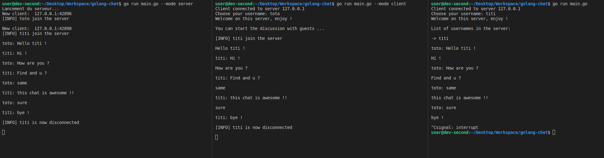

# Golang chat application

This application is based on the TCP protocol and used ```net``` package to run server.  
Instant messaging application that works in command prompt and written with the go programming langage.




## Prerequisites before running the script :

Install go compiler

<br />

## How it run it :

- Create a server
  
  To create a discussion, you first must host a server. To do this, simply run the following command:

  ```shell
  go run main.go --mode server
  ```

- Create a client

  ```shell
  go run main.go --mode client
  ```

- then choose an username for your client in the command prompt to start the discussion

- a log file appears when server is running with all informations.

<br />

## Share this chat

You can share this application by building ```main.go``` file :

```shell 
go build main.go
```

Then launch this executable with previous options.